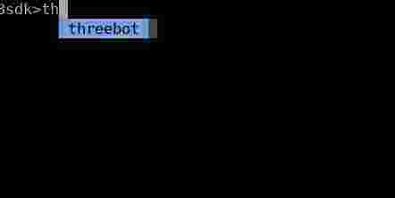
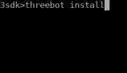
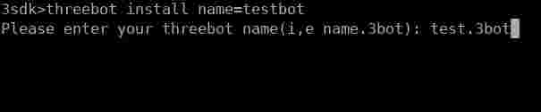
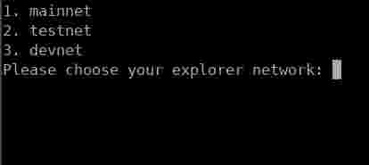

# Working with 3sdk

`3sdk` is a command line tool that provides the user with a simple interface to orchestrate his threebot containers.
It allows the user to create a container that is ready to start a threebot server on with the user identity already registered on that container.

## Using 3sdk

You can get the binary from the [release page](https://github.com/threefoldtech/js-ng/releases). Make sure to change permission to allow the binary to be executed as follows:

```bash
chmod +x {binary_path}
```

Once inside the shell you can see that it provides auto completion to the available commands:



To install a new threebot container:



The user will be prompted to enter his user information which includes:

- His 3bot name
- His 3bot email
- His phrase which is normally found in his `3bot connect` app



The user is then asked to choose which explorer networks he is in:



The container should be created now with default name `3bot-ng`.

## Building the 3sdk

You can get latest available binary by using `pyinstaller`. Which creates the `3sdk` binary based on `threesdk.spec` file.

To install `pyinstaller` run:

```bash
pip3 install pyinstaller
```

And then to create the binary:

```bash
cd {jsng repo path}
pyinstaller threesdk.spec
```

Binary should be created under `dist` directory in the repo root, and is ready to be used.

### Building a static executable

You bundle the dynamic executables to ensure that the binary can be run on any system by creating a static executable.

First you need to install `staticx`:

```bash
pip3 install staticx
```

After building your binary run the following for a static executable:

```bash
staticx dist/3sdk  3sdk.static
```
