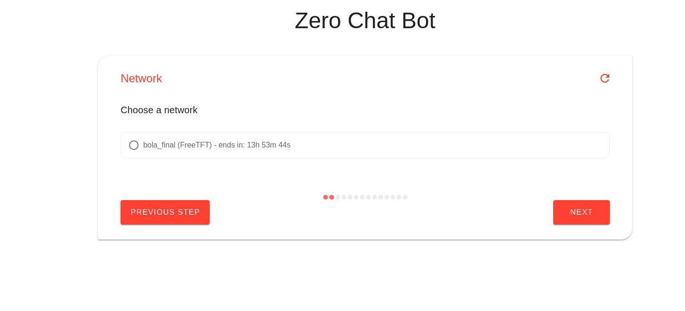
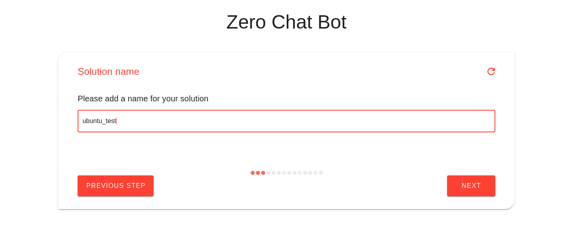
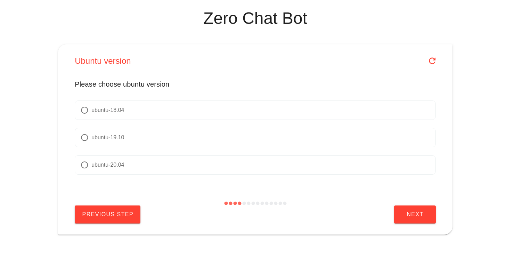

# Chatflow Engine


Chatflows are an interactive communication bot that can be used to interactively ask the user some questions then perform actions based on the user's choices. think of serving a customer, handling invoices, buying items or in our case provisioning workloads on the grid.

## Usage

it's very easy to define a new bot, you just need to make sure it's added in a package and that package is installed. The chatflow should be under the `/chatflows` directory in the package created.

Here is an example for a simple chatflow that will help you order a meal from one of your favorite restaurants

```python
from jumpscale.god import j

from jumpscale.sals.chatflows.chatflows import GedisChatBot

class Your_Order(GedisChatBot):
    # Sample data
    menus = {
        "3 Burger": {
            "main": ["Cheese Burger", "Douple Burger"],
            "sides": ["fries", "Onion rings"],
        },
        "3 Pizza": {
            "main": ["Chicken Pizza", "Beef Pizza", "Cheese Pizza"],
            "sides": ["fries", "Cheese"],
        }
    }

    # Ask the user about his name
    name = self.string_ask("Hello, What's your name?")

    # display a dropdown containing your favourite Restaurants
    restaurant_name = self.drop_down_choice("Please select a Resturant", menus.keys())

    # display the main dishes of the selected restaurant so the user can choose only one dish
    main_dish = self.single_choice("Please Select your main dish", menus[restaurant_name]["main"])

    # ask about the mount (this accepts any integer)
    amount = self.int_ask("How many {} do you want".format(main_dish))

    # ask about the side dishes (the user can choose multible side dishes)
    side_dish = self.multi_choice("what do you want with your order", menus[restaurant_name]["sides"])

    # Now you can add any logic you want here to send the order to the restaurant
    # Then we can show a report to the user about his order using md format
    report = """# Hello {name}
    your order has been confirmed
    you have ordered : {amount} {main_dish] with {side_dish}
    """.format(name=name, amount=amount, main_dish=main_dish, side_dish=side_dish)

    self.md_show(report)
```


### Available types:

- ask
- string_ask
- secret_ask
- int_ask
- text_ask
- single_choice
- multi_choice
- multi_list_choice
- drop_down_choice
- autocomplete_drop_down
- datetime_picker
- time_delta_ask
- location_ask
- download_file
- upload_file
- qrcode_show
- captcha_ask
- md_show
- md_show_confirm
- loading_show
- new_form
- multi_values_ask
- chatflow_step

### Example of chatflow steps:

```python
from jumpscale.god import j

from jumpscale.sals.chatflows.chatflows import GedisChatBot, chatflow_step
from jumpscale.sals.reservation_chatflow.models import SolutionType

class UbuntuDeploy(GedisChatBot):
    steps = [
        "ubuntu_start",
        "ubuntu_network",
        "ubuntu_name",
        "ubuntu_version",
    ]

    @chatflow_step()
    def ubuntu_start(self):
        self.user_form_data = dict()
        self.query = dict()
        self.HUB_URL = "https://hub.grid.tf/tf-bootable"
        self.IMAGES = ["ubuntu-18.04", "ubuntu-19.10", "ubuntu-20.04"]
        self.user_form_data["chatflow"] = "ubuntu"
        self.md_show("# This wizard will help you deploy an ubuntu container", md=True)


    @chatflow_step(title="Network")
    def ubuntu_network(self):
        self.network = j.sals.reservation_chatflow.select_network(self, j.core.identity.me.tid)

    @chatflow_step(title="Solution name")
    def ubuntu_name(self):
        self.user_form_data["Solution name"] = self.string_ask(
            "Please enter a name for your ubuntu container", required=True, field="name"
        )

    @chatflow_step(title="Ubuntu version")
    def ubuntu_version(self):
        self.user_form_data["Version"] = self.single_choice("Please choose ubuntu version", self.IMAGES, required=True)


```





