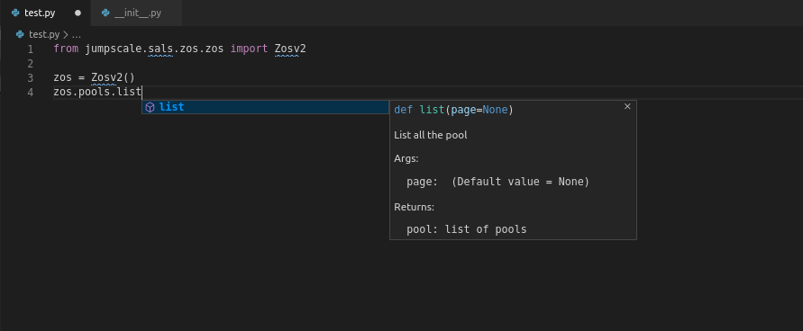

# IDE/Editor setup

## VSCode

[VSCode](https://code.visualstudio.com) is a very popular extensible code editor with many extensions to provide an IDE-like experience


### Poetry integration
You only need in `user settings` specify `python.venvPath` to the directory where poetry hosts its virtualenvs. e.g on linux that's `~/.cache/poetry/virtualenvs`

and make sure to select python interpreter (Ctrl+P then select interpreter)

#### Auto-completion with poetry virtual environment

You can configure poetry to create the virtual environment inside the project directory so vscode can detect it and you can select its interpreter without extra vscode configuration.

Before you start, if you've an old environment in `~/.cache/pypoetry`, see how to remove it [here](#removing-old-virtual-environment-in-cache-directory).

First, let's check current poetry configuration:

```
poetry config --list
```

It should output something like:

```
cache-dir = "/home/username/.cache/pypoetry"
virtualenvs.create = true
virtualenvs.in-project = false
virtualenvs.path = "{cache-dir}/virtualenvs"  # /home/username/.cache/pypoetry/virtualenvs
```

Now we need to change `virtualenvs.in-project` configuration to be `true`, this can be done as follows:

```
poetry config virtualenvs.in-project true
```

Now we can simply clone our repository and change the directory to it, then start installation:

```
poetry install
```

And it will tell us that the newly created virtual environment will be at `.venv`:

```
Creating virtualenv js-sdk in /home/username/test/js-sdk/.venv
Installing dependencies from lock file
Package operations: ...
```

 After successful installation, we can open vscode and press `Control +Shift + P` and try to select the interpreter, it should be listed without any extra configuration:


Then trying to write a new script e.g. `test.py`:



Note that global `j` object completion is only supported in `jsng` shell.


##### Removing old virtual environment in cache directory

You should make sure that no virtual environments were created in `~/.cache/pypoetry` for your current project:

```
poetry env list --full-path
```

If it shows something like:

```
/home/username/.cache/pypoetry/virtualenvs/js-sdk-2MKXmKJD-py3.6 (Activated)
```

Then make sure it's deactivated and you're outside this environment in the shell and do the following to remove it:


```
poetry env remove js-sdk-2MKXmKJD-py3.6
```

Output:

```
Deleted virtualenv: /home/abom/.cache/pypoetry/virtualenvs/js-sdk-2MKXmKJD-py3.6
```

### Recommended extensions

- `autoDocString` to ensure correct docstrings.
- `pyright` for static checking your code while writing in vscode.
- `AREPL` for a realtime python scratch pad.
- `Better TOML` toml config supported.
- `GitLens` for boosted git experience.
- `Git graph` view a graph of your repository.
- `Prettify JSON`
- `TabNine` AI based code completion
