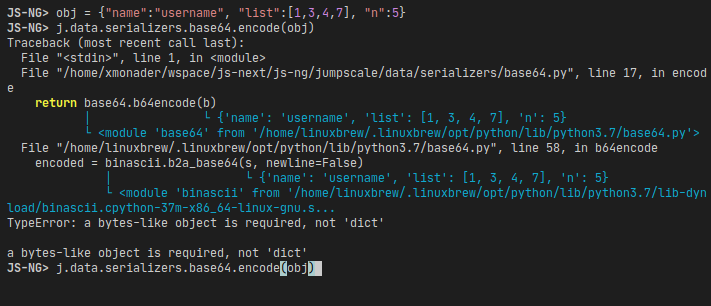

# Exceptions
we provide a carefully picked list of exceptions


- Base
- Permission
- Halt
- Runtime
- Input
- Value
- NotImplemented
- Bug
- Operations
- IO
- NotFound
- Timeout
- SSH
- SSHTimeout

## better_exceptions

we integrate [better_exceptions](https://github.com/Qix-/better-exceptions) for friendly, humane stacktraces



```
JS-NG> j.data.serializers.base64.encode(obj)
Traceback (most recent call last):
  File "<stdin>", line 1, in <module>
  File "/home/xmonader/wspace/threefoldtech/js-ng/jumpscale/data/serializers/base64.py", line 17, in encod
e
    return base64.b64encode(b)
           │                └ {'name': 'username', 'list': [1, 3, 4, 7], 'n': 5}
           └ <module 'base64' from '/home/linuxbrew/.linuxbrew/opt/python/lib/python3.7/base64.py'>
  File "/home/linuxbrew/.linuxbrew/opt/python/lib/python3.7/base64.py", line 58, in b64encode
    encoded = binascii.b2a_base64(s, newline=False)
              │                   └ {'name': 'username', 'list': [1, 3, 4, 7], 'n': 5}
              └ <module 'binascii' from '/home/linuxbrew/.linuxbrew/opt/python/lib/python3.7/lib-dynload/binascii.cpython-37m-x86_64-linux-gnu.s...
TypeError: a bytes-like object is required, not 'dict'

a bytes-like object is required, not 'dict'
```
